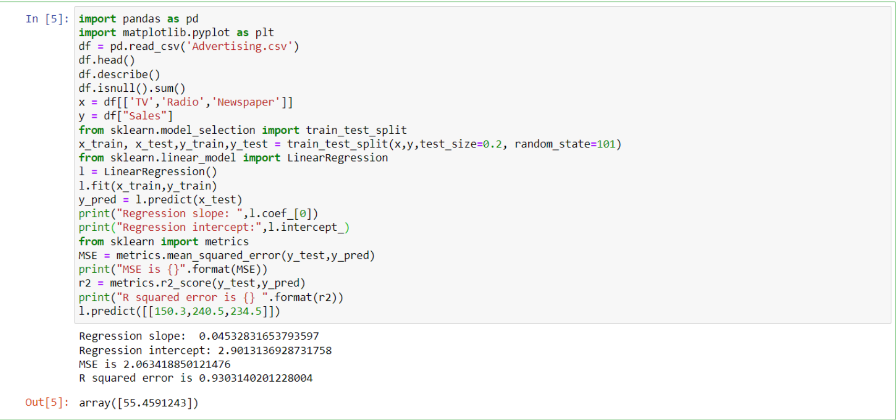

# Implementation-of-Multivariate-Linear-Regression-Model-for-Sales-Prediction

## AIM:
To write a program to implement the multivariate linear regression model for sales prediction.

## Equipments Required:
1. Hardware – PCs
2. Anaconda – Python 3.7 Installation / Moodle-Code Runner

## Algorithm
## step1
Import the required libraries.

## step2
Read the csv file using pandas.

## step3
Declare X and Y variable with respect to the dataset.

## step4
Predict the values.

## step5
Using Mean Square Error find the required line that fits the data.

## step6
Print the Mean Square Error and R square error.

## step7
End the program.

## Program:
```
~~~
Program to implement the multivariate linear regression model for sales prediction.
Developed by:A.Sasidharan
RegisterNumber:212221240049
~~~
import pandas as pd
import matplotlib.pyplot as plt
df = pd.read_csv('Advertising.csv')
df.head()
df.describe()
df.isnull().sum()
x = df[['TV','Radio','Newspaper']]
y = df["Sales"]
from sklearn.model_selection import train_test_split
x_train, x_test,y_train,y_test = train_test_split(x,y,test_size=0.2, random_state=101)
from sklearn.linear_model import LinearRegression
l = LinearRegression()
l.fit(x_train,y_train)
y_pred = l.predict(x_test)
print("Regression slope: ",l.coef_[0])
print("Regression intercept:",l.intercept_)
from sklearn import metrics
MSE = metrics.mean_squared_error(y_test,y_pred)
print("MSE is {}".format(MSE))
r2 = metrics.r2_score(y_test,y_pred)
print("R squared error is {} ".format(r2))
l.predict([[150.3,240.5,234.5]])

```

## Output:



## Result:
Thus the program to implement the multivariate linear regression model for sales prediction is written and verified using python programming.
